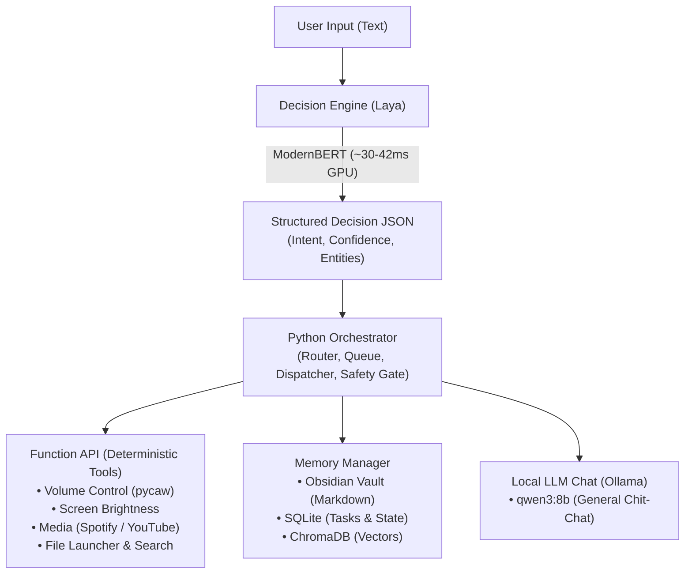

<div align="center">

# 🎙️ OpenVoice

**A local-first, privacy-respecting personal operating system inspired by JARVIS and FRIDAY.**

[](https://python.org)
[](https://pytorch.org)
[-brightgreen.svg)](#-benchmark-results)
[-success.svg)](#-benchmark-results)
[](LICENSE)
[](CODE_OF_CONDUCT.md)

*OpenVoice is not a chatbot. It is a deterministic, audited OS execution core that translates user intent into concrete system actions and manages personal memory without leaking data to the cloud.*

---

</div>

## ⚡ Highlights

- **Blazing Fast Intent Classification**: Powered by Laya's non-autoregressive encoder (ModernBERT-large, 421M params). Inference executes in **~30–42 ms** on modern GPUs with calibrated probabilities and zero text-generation hallucination.
- **Tri-Tier Memory Manager**:
  - **Obsidian Vault**: Markdown-based human-auditable knowledge base (`data/vault/`).
  - **SQLite State**: Relational tables for deterministic task tracking and system state.
  - **ChromaDB**: Semantic vector retrieval using local embeddings (`all-MiniLM-L6-v2`) on GPU/CPU.
  - **Hybrid Search**: Fuses exact database lookups, keyword scans, and dense vector similarity with source provenance.
- **Deterministic & Audited**: Adheres to strict architectural safety gates. Every action maps to a predefined Python tool — **no AI-generated shell scripts (`bash`/`cmd`/`powershell`)**.
- **Hardware-Accelerated**: Native support for NVIDIA GPUs including Blackwell (`sm_120`), Ada Lovelace, and Ampere with dynamic fallback to CPU.

---

## 🏛️ Architecture



---

## 📊 Benchmark Results

OpenVoice benchmark harness tests **504 hand-labeled, multi-domain user intents** (`app/decision/dataset/intents.json`).

| Metric | CPU Baseline | NVIDIA RTX 5050 GPU | Acceptance Target | Status |
| :--- | :--- | :--- | :--- | :--- |
| **Intent Accuracy** | 100.00% (504/504) | **100.00% (504/504)** | $\ge 95.0\%$ | **PASS** |
| **P95 Latency** | 488.4 ms | **42.9 ms** | $\le 50\text{ ms (GPU)} / \le 500\text{ ms (CPU)}$ | **PASS (11.4× speedup)** |
| **Mean Latency** | 449.5 ms | **61.4 ms** | — | **PASS** |
| **Malformed Outputs** | 0 | **0** | 0 | **PASS (Structural guarantee)** |
| **Test Suite** | 49/49 passed | **49/49 passed** | 100% | **PASS** |

---

## 🚀 Quick Start

### 1. Prerequisites
- Python 3.12+ (tested on Python 3.14)
- Git
- NVIDIA GPU with updated drivers (optional, for sub-50ms latency)

### 2. Clone & Setup Virtual Environment
```bash
git clone https://github.com/arzeck/openvoice.git
cd openvoice

# Create virtual environment
python -m venv venv

# Activate virtual environment
# Windows PowerShell:
.\venv\Scripts\Activate.ps1
# Linux / macOS:
source venv/bin/activate
```

### 3. Install Dependencies
```bash
pip install -e ".[dev]"
```

#### Optional: Enable GPU Acceleration (NVIDIA)
To enable native hardware acceleration on your GPU:
```bash
# For NVIDIA RTX 50-series (Blackwell / sm_120):
pip install --no-deps --force-reinstall torch --index-url https://download.pytorch.org/whl/cu130

# For NVIDIA RTX 30 / 40-series:
pip install --no-deps --force-reinstall torch --index-url https://download.pytorch.org/whl/cu126
```

### 4. Configure Environment
```bash
cp .env.example .env
```
Key settings in `.env`:
```ini
MODEL_DECISION=laya
DEVICE=auto          # auto | cuda | cpu
EMBEDDING_MODEL=all-MiniLM-L6-v2
VAULT_PATH=./data/vault
SQLITE_PATH=./data/sqlite/openvoice.db
CHROMA_PATH=./data/chroma
```

### 5. Run the Benchmark
Verify the Decision Engine performance:
```bash
python scripts/benchmark.py
```

### 6. Run Test Suite
```bash
python -m pytest tests/ -v
```

---

## 📂 Repository Structure

```
openvoice/
├── app/
│   ├── core/                  # Configuration, logging, schemas & types
│   │   ├── config.py          # Pydantic settings with device auto-detection
│   │   ├── logging.py         # Structured JSON logger with execution timers
│   │   └── types.py           # Core enums and intent categories
│   ├── decision/              # Decision Engine (System 1)
│   │   ├── engine.py          # Public entrypoint for intent classification
│   │   ├── laya.py            # Laya ModernBERT adapter & disambiguation policy
│   │   ├── schema.py          # Pydantic Decision output model
│   │   └── dataset/           # 504-sample balanced benchmark dataset
│   ├── memory/                # Tri-Tier Memory Manager
│   │   ├── manager.py         # Unified async gateway
│   │   ├── obsidian.py        # Obsidian Markdown file CRUD
│   │   ├── sqlite.py          # Structured state & task tables
│   │   ├── chroma.py          # Semantic vector store
│   │   └── embeddings.py      # Sentence-transformers on GPU/CPU
│   ├── orchestrator/          # Routing, dispatching & safety gates (Phase 1)
│   │   ├── router.py          # Intent routing
│   │   ├── dispatcher.py      # Tool execution & confirmation gating
│   │   └── queue.py           # Command queue
│   └── tools/                 # Deterministic Python system tools (Phase 1)
├── data/                      # Local storage (gitignored)
│   ├── vault/                 # Obsidian markdown notes
│   ├── sqlite/                # Relational SQLite database
│   └── chroma/                # ChromaDB vector store
├── scripts/
│   └── benchmark.py           # CLI benchmark runner
└── tests/                     # Pytest suite
    ├── decision/              # Unit tests for classification & confidence
    └── memory/                # Unit tests for vault, SQLite, and hybrid search
```

---

## 🗺️ Roadmap & Phase Gates

OpenVoice follows a strict phase-gated engineering process. No feature may bypass its phase gate.

- [x] **PRE-PHASE-0**: Core Decision Engine & Tri-Tier Memory Gateway  
  *100% benchmark accuracy, GPU acceleration (~30–42ms), hybrid memory search, 49/49 tests passing.*
- [ ] **PHASE-1** *(In Progress)*: Execution Orchestrator, Deterministic System Tools & Entity Extraction  
  *Windows volume (pycaw), display brightness, Spotify/YouTube media controls, safe application launcher, command queue, Ollama chat fallback.*
- [ ] **PHASE-2**: Audio & Voice Layer  
  *Local Whisper STT (faster-whisper), Piper TTS, Silero Voice Activity Detection (VAD).*
- [ ] **PHASE-3**: User Interface & System Tray  
  *Minimalist desktop HUD, status tray, voice indicators.*
- [ ] **PHASE-4**: Home Automation & Ecosystem  
  *Local Home Assistant API integration, smart home device control.*

---

## 🛡️ Non-Negotiable Rules

1. **R1. The Router Never Executes**: The Decision Engine classifies intent and extracts entities; it never executes shell commands or controls OS APIs directly.
2. **R2. No AI-Generated Shell**: Every action maps to an audited, predefined Python function. No raw `bash` or `powershell` strings generated by language models.
3. **R3. Human Owns Memory**: Obsidian markdown files are the sole canonical truth for notes. SQLite stores structured state, ChromaDB stores dense vectors.
4. **R4. Strict Phase Gating**: We build rock-solid foundations before adding voice, UI, or cloud integrations.

---

## 🤝 Contributing

Contributions are welcome! Please read our [Contributing Guidelines](CONTRIBUTING.md) and [Code of Conduct](CODE_OF_CONDUCT.md) before submitting pull requests.

---

## 📄 License

OpenVoice is open-source software licensed under the [MIT License](LICENSE).