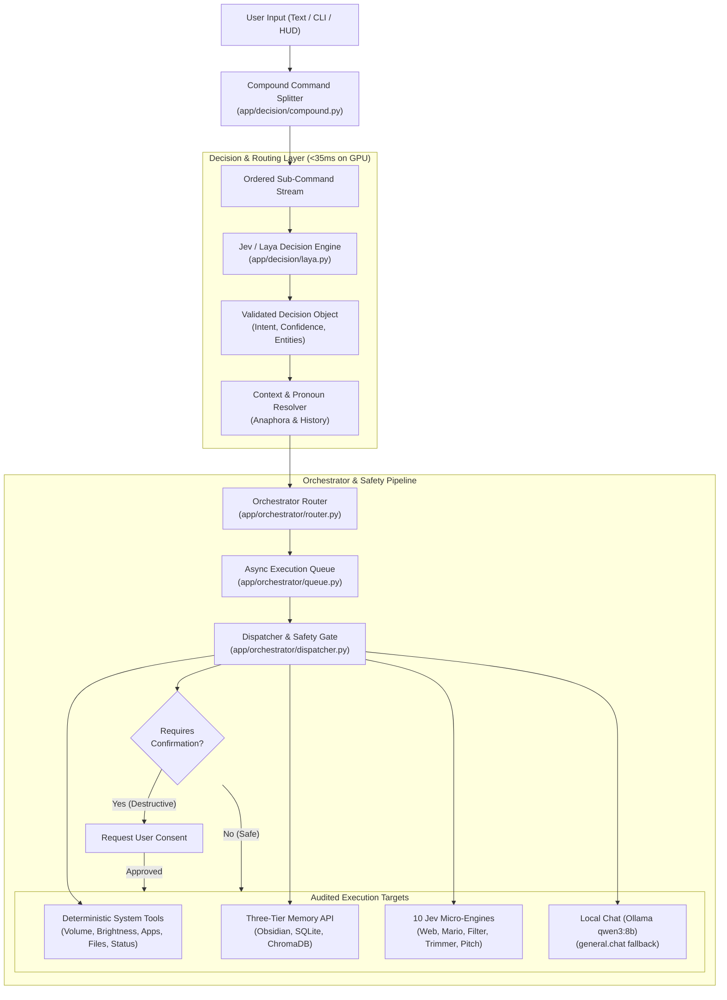
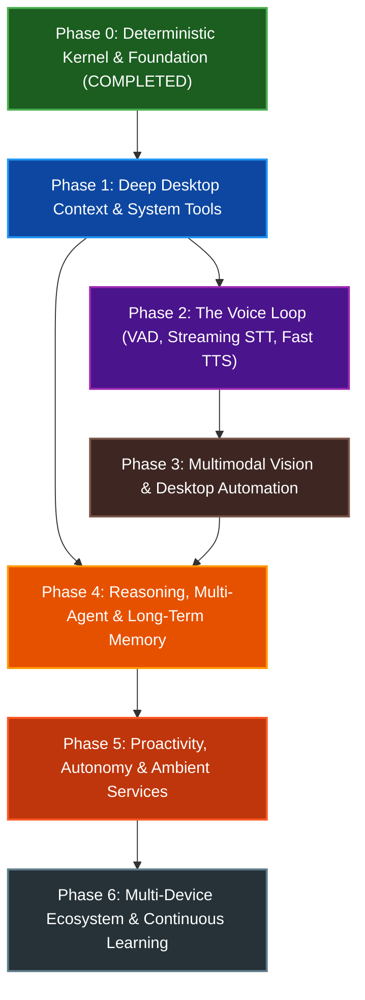

# PLAN.md

> OpenVoice Master Development Specification & Phase-Wise Roadmap
> Version: v2.0
> Status: PHASE 1 IN PROGRESS (PHASE 0 COMPLETE & VERIFIED — 84/84 TESTS PASSING)
> Architecture: Local-First, Deterministic, Non-Autoregressive Logic-Gate Operating System
> Hardware Target: NVIDIA GeForce RTX 5050 Laptop GPU (CUDA 13.0) + Local CPU
> Last Updated: 2026-10-01

---

# 1. Project Vision

OpenVoice is a fully local, privacy-first personal operating system inspired by the simplicity, responsiveness, and determinism of JARVIS/FRIDAY.

It is **not** a generic conversational chatbot.

Its purpose is to:
1. Instantly understand user intent using non-autoregressive logic gates (<30ms).
2. Decompose and execute multi-intent compound commands safely.
3. Manage human-owned long-term memory across markdown notes, relational tables, and semantic vectors.
4. Directly control the local operating system through audited, predefined Python functions.
5. Provide ambient context awareness (active window, clipboard, schedule).
6. Optionally escalate to local/cloud deep reasoning models strictly when needed.

### Core Tenets:
- **Local-first**: Zero mandatory internet egress; fully functional offline.
- **Human-auditable**: Actions are transparent, reversible, and logged to append-only JSON files.
- **Deterministic**: Hard guarantees on execution; zero hallucinated shell invocations.
- **Modular & Phase-Gated**: Rigid progression across development phases without jumping ahead.

---

# 2. Non-Negotiable Rules

## R1. Router Never Executes Shell Commands
The decision engine (Jev/Laya) only classifies intent and outputs validated structured JSON. It never:
- Invokes shell/PowerShell interpreters.
- Directly writes or deletes filesystem nodes.
- Interacts with operating system control APIs directly.

## R2. No AI-Generated Shell Execution
Every operating system interaction must map to a predefined, statically audited Python function.
- ❌ **Forbidden**: User Request → LLM → `powershell Remove-Item -Path "..."`
- ✅ **Required**: User Request → Decision Engine → `system.file.delete` → deterministic, checked Python function with safety confirmation.

## R3. Human Owns Memory
- Canonical text and notes reside in an **Obsidian Markdown Vault** (`data/vault/`).
- Structured tasks, events, and entity records reside in **SQLite** (`data/sqlite/openvoice.db`).
- Semantic vector indexes reside in **ChromaDB** (`data/chromadb/`) using `all-MiniLM-L6-v2`.
- Memory is transparent, portable, human-editable, and never duplicated or siloed in proprietary blobs.

## R4. Strict Phase Gating
Features are strictly developed in their designated phase.
- **Phase 0**: Kernel, Logic-Gate Decision Engine, Memory, 10 Jev micro-engines, Multi-command splitting (✅ COMPLETE).
- **Phase 1**: Deep Desktop Context, Advanced Tools, Entity Extractor, System Tray (CURRENT).
- **Phase 2**: Voice Loop (VAD, faster-whisper STT, Piper TTS, barge-in) (QUEUED).
- **Phase 3**: Multimodal Vision, Screen OCR, Playwright Web Agent (QUEUED).
- **Phase 4**: Deep Reasoning, Multi-Agent Planning, Lifelong Memory (QUEUED).
- **Phase 5**: Proactivity, Autonomy, Smart Home IoT (QUEUED).
- **Phase 6**: Multi-Device Sync, Voice Biometrics, Continuous Learning (QUEUED).

*Zero microphone/audio code is introduced before Phase 2.*

---

# 3. High-Level Architecture

---

# 4. Master Phase-Wise Roadmap & Checklist

---

## Phase 0: Deterministic Kernel, Fast Decisions & Core Tools
> **Status: ✅ 100% COMPLETED & VERIFIED (84/84 tests passing)**  
> **Core Objective**: Establish the ultra-fast local logic-gate router, zero-AI-shell safety policies, three-tier local memory, and multi-command parsing on GPU.

- [x] **0.1 Architecture & Safety Gates**
  - [x] Non-negotiable Rule R1: Router never executes shell directly (intent classification only).
  - [x] Non-negotiable Rule R2: Pure Python audited tool functions (zero AI-generated PowerShell).
  - [x] Non-negotiable Rule R3: Human-owned memory (Obsidian markdown, SQLite state, ChromaDB vectors).
  - [x] Non-negotiable Rule R4: Strict phase gating (zero audio/mic hooks before Phase 2).
  - [x] Confirmation gating for destructive operations with explicit user prompt.
  - [x] Offline fallback with zero mandatory internet egress.
- [x] **0.2 Decision Engine (Jev / Laya)**
  - [x] Laya non-autoregressive decision model running on GPU (RTX 5050 Laptop GPU, `cuda`).
  - [x] GPU kernel warmup on boot delivering 25–35 ms steady-state inference.
  - [x] Calibrated confidence scoring and uncertainty thresholding (`escalate` flag).
  - [x] Disambiguation policy for overlapping intents (Spotify vs notes vs status).
- [x] **0.3 Multi-Command Chaining & Anaphora**
  - [x] Deterministic compound command splitter (`CompoundCommandParser`) handling `and`, `then`, `also`, `;`.
  - [x] Shared-verb expansion (e.g. `set brightness to 50% and volume to 50%`).
  - [x] Sequential multi-command execution with aggregated status reports.
  - [x] Conversational context carryover (`last_intent`) for pronoun resolution (`it`, `that`, `set it to 100%`).
- [x] **0.4 Core Operating System Tools**
  - [x] Hardware volume control via `pycaw` (get, set, relative adjustment, mute/unmute).
  - [x] Display brightness control via `screen_brightness_control` (get, set, full, dim).
  - [x] Dynamic Windows Start Menu application discovery & execution (80+ installed apps).
  - [x] Safe process closer (`system.file.close`) with Windows core process protection.
  - [x] Media control shortcuts (Spotify, YouTube search and playback).
  - [x] Hardware telemetry tool (`system.status`): Battery, CPU load, RAM usage, Disk space, IP, clock/date.
  - [x] Workstation locking via native `LockWorkStation()`.
- [x] **0.5 Local-First Memory (Three-Tier)**
  - [x] Human-readable knowledge notes in Obsidian Markdown vault (`data/vault/`).
  - [x] Structured transactional tasks and events in SQLite (`data/sqlite/openvoice.db`).
  - [x] Semantic vector similarity search via ChromaDB + `sentence-transformers` (`all-MiniLM-L6-v2`).
  - [x] Three-stage hybrid search (SQLite exact → Obsidian keyword → ChromaDB vector).
- [x] **0.6 The 10 Jev Discrete Logic Micro-Engines**
  - [x] Lightning-Fast Web Agent (`FastWebAgent`): click selection from numbered element list.
  - [x] Super Mario Bros Game Controller (`MarioGameController`): 7 discrete moves in 20ms.
  - [x] Real-Time Sponsor Skipper (`SponsorSkipper`): video transcript segment classification.
  - [x] Auto-Sorting Downloads Folder (`DownloadsSorter`): metadata & content file organizer.
  - [x] "Engagement Bait" Filter (`ContentFilter`): plain-English social timeline moderation.
  - [x] Instant UI Builder (`InstantUIBuilder`): pre-built component layout assembler.
  - [x] AI Context Trimmer (`ContextTrimmer`): deterministic KEEP_EXACT vs DROP_FILLER optimizer.
  - [x] Simulated Air Traffic Controller (`AirTrafficController`): tower clearance logic machine.
  - [x] "Kill My Idea" Pitch Evaluator (`PitchEvaluator`): multi-criteria startup idea evaluator.
  - [x] "Word Salad" Chatbot Demo (`WordSaladDemonstrator`): logic-gate architecture demonstrator.
- [x] **0.7 Engineering & Quality**
  - [x] 84/84 automated Pytest test suite covering tools, decision, memory, orchestrator, and features.
  - [x] Zero-defect `ruff` code formatting and linting.

---

## Phase 1: Deep Desktop Context, Advanced Tools & System Tray
> **Status: 🟡 CURRENT PHASE**  
> **Core Objective**: Give OpenVoice full ambient awareness of the Windows desktop (active window, selected text, clipboard) and deepen audited file, window, and scheduling tools.

- [ ] **1.1 Desktop Perception & Context Awareness (Non-Vision)**
  - [ ] Active window detection (detect currently focused process name, window title, exe path).
  - [ ] Active tab/document title extraction (browser URL/tab title via UIAutomation/Accessibility APIs).
  - [ ] Clipboard history and content awareness (selected text quick-ask, clipboard paste ingestion).
  - [ ] Day-of-week, time zone, locale, and schedule awareness.
  - [ ] Activity detection (detect if user is gaming, working in IDE, in a full-screen app, or idle).
- [ ] **1.2 Advanced Desktop Tools**
  - [ ] Window management: Minimize, maximize, restore, snap left/right, move across multi-monitors (`pywin32` / Win32 API).
  - [ ] Enhanced file operations: Safe move, rename, duplicate, recursive file find, and hash deduplication.
  - [ ] Natural language time expression parsing (`dateparser` / regex: "in 20 mins", "next Monday at 3pm").
  - [ ] Unit & number normalization (currencies, metric/imperial conversions, math evaluations).
  - [ ] Contact & address resolution in SQLite (people memory: email, phone, relations).
  - [ ] System notifications sender (Windows Toast notifications via `win11toast` / PowerShell bridge).
- [ ] **1.3 Safety, Permissions & Audit Logging**
  - [ ] Explicit 3-tier permission matrix:
    - Tier 1: **Safe / Auto-Execute** (status, search, read notes, app launch, volume).
    - Tier 2: **Confirm / Guarded** (file delete, process kill, email send, lock pc).
    - Tier 3: **Restricted / Denied** (registry changes, system file modification, unapproved domains).
  - [ ] Dry-run execution preview (`--dry-run` flag showing what actions would occur).
  - [ ] Append-only tamper-evident audit log with JSON structured traces.
  - [ ] Explainability output ("Why did you do that?": inspect router intent, criteria, and entities).
- [ ] **1.4 Interface & Minimal Presence**
  - [ ] System Tray / Taskbar app (Windows notification icon, status orb).
  - [ ] Global hotkey quick-ask HUD (`Win + Shift + Space` opens instant command bar).
  - [ ] Visual state indicators: `Idle`, `Listening`, `Thinking`, `Executing`, `Error`.

---

## Phase 2: The Voice Loop — Real-Time Perception & Low-Latency Speech
> **Status: ⚪ QUEUED (Phase Gate: Phase 1 must pass Definition of Done)**  
> **Core Objective**: Break the text barrier. Build a true voice loop with wake-word detection, local streaming STT, and natural streaming TTS with sub-150ms latency.

- [ ] **2.1 Audio Perception (Input)**
  - [ ] Wake word / hotword engine (local `openWakeWord` or Porcupine, e.g. "Hey Jarvis" / "OpenVoice").
  - [ ] Push-to-talk hotkey toggle and single-trigger hotkey mode.
  - [ ] Voice Activity Detection (VAD) via `Silero VAD` (accurate start/end-of-speech detection).
  - [ ] Streaming Speech-to-Text (STT) via `faster-whisper` (large-v3-turbo / base.en on GPU with FP16/INT8).
  - [ ] Partial / interim real-time transcript streaming while user is speaking.
  - [ ] Barge-in / interruption detection: immediately cut off assistant TTS output when user starts speaking.
  - [ ] Microphone preprocessing: noise suppression, acoustic echo cancellation (AEC), and gain normalization.
  - [ ] Low-volume / whisper speech detection.
  - [ ] Multilingual STT and code-switching (e.g. Hinglish: Hindi + English mixed speech).
- [ ] **2.2 Speech Synthesis (Output)**
  - [ ] Low-latency local streaming TTS via `Piper TTS` (RTF < 0.1, first audio packet < 100ms).
  - [ ] Sentence-level streaming pipeline (start synthesizing sentence 1 while sentence 2 is being formatted).
  - [ ] Audio ducking (automatically lower background Spotify/media volume by 80% while assistant speaks).
  - [ ] Auditory Earcons: crisp, subtle audio chimes (wake acknowledged, command done, error, confirmation).
  - [ ] Spoken vs on-screen content split (speak a brief 1-sentence answer, render rich table/details on screen).
  - [ ] Speed, pitch, volume, and emotional prosody control.
  - [ ] Custom / cloned voice models and pronunciation dictionary for custom jargon/names.
  - [ ] Whisper mode (detect whispered speech → reply in whispered/quiet voice).

---

## Phase 3: Multimodal Vision, Screen Understanding & Browser Agent
> **Status: ⚪ QUEUED**  
> **Core Objective**: Give OpenVoice eyes. Enable it to see the screen, understand documents and camera feeds, and autonomously navigate web applications.

- [ ] **3.1 Screen Understanding & Computer Vision**
  - [ ] Instant screen capture & multi-monitor screenshot router.
  - [ ] Fast local OCR (Windows Media OCR / EasyOCR / Tesseract) for on-screen text extraction.
  - [ ] Visual UI element detection (identify buttons, form inputs, navigation bars without heavy VLM).
  - [ ] Document and PDF visual Q&A (read slides, tables, receipts, architectural diagrams).
  - [ ] Image editing & generation integration (local SDXL / FLUX or external API).
- [ ] **3.2 Camera & Spatial Perception**
  - [ ] Webcam ingestion stream with on-demand frame capture.
  - [ ] Face recognition for local user profile authentication.
  - [ ] Hand gesture tracking and pose detection (MediaPipe: mute gesture, wave, stop).
  - [ ] Gaze and presence detection (screen stays awake when user looks, sleeps when away).
  - [ ] Ambient sound classifier (detect doorbell, baby crying, fire alarm, glass break).
- [ ] **3.3 Web Browsing Agent & Computer Use**
  - [ ] "Jev UltraFast" Playwright headless browser agent (execute bookings, research, logins).
  - [ ] Page summarization (summarize long articles, YouTube video transcripts, forum threads).
  - [ ] Visual form filling and checkout automation (under explicit human confirmation gate).
  - [ ] Prompt injection firewall for untrusted web pages (data is never executed as system instructions).

---

## Phase 4: Long-Term Memory, Multi-Agent Planning & Deep Reasoning
> **Status: ⚪ QUEUED**  
> **Core Objective**: Elevate OpenVoice from an imperative tool-runner into an autonomous cognitive partner with lifelong memory and multi-step reasoning.

- [ ] **4.1 Cognitive Architecture & Planning**
  - [ ] ReAct multi-step planning loop (Plan → Act → Observe → Critique → Conclude).
  - [ ] Task decomposition: break complex goals ("organize my tax documents for 2026") into sub-tasks.
  - [ ] Replanning and self-healing when a tool call fails.
  - [ ] Chain-of-thought verification for complex logic, math, and code execution.
  - [ ] Step budget enforcement and infinite loop breakers.
  - [ ] Cost-aware model tiering:
    - Tier 1: Fast Jev (30ms logic gates, zero LLM cost).
    - Tier 2: Local Ollama Qwen 8B (fast local chat, summaries, extraction).
    - Tier 3: Optional Deep Cloud Reasoning (Claude 3.7 / Gemini 2.0 Flash) for 100k+ token codebases.
- [ ] **4.2 Multi-Agent Orchestration**
  - [ ] Coordinator agent delegating to named specialist sub-agents:
    - Code Specialist (syntax checking, test execution, git operations).
    - Research Specialist (web searching, paper synthesis, fact verification).
    - Home & Hardware Specialist (IoT controls, telemetry, diagnostics).
  - [ ] Fan-out / Fan-in parallel execution across sub-agents.
- [ ] **4.3 Lifelong Memory & Personalization**
  - [ ] Episodic memory in SQLite/Obsidian ("What project did we debug last Tuesday?").
  - [ ] Habit and routine learning (predict recurring workflows based on day of week / time).
  - [ ] Memory write policy: automated decision engine deciding what is worth saving vs discarded.
  - [ ] Memory consolidation and decay (archive obsolete tasks, merge duplicate notes).
  - [ ] Memory correction and provenance ("That phone number is outdated, update it").
  - [ ] User privacy tiers and memory inspection UI in Obsidian.

---

## Phase 5: Proactivity, Autonomy & Ambient Background Services
> **Status: ⚪ QUEUED**  
> **Core Objective**: Transform OpenVoice from reactive (waiting for commands) into proactive (anticipating needs and working in the background).

- [ ] **5.1 Background Autonomy & Queues**
  - [ ] Persistent background task queue with priority scheduling and preemption.
  - [ ] Checkpointed long-running tasks with pause, resume, and progress reporting.
  - [ ] AFK (Away From Keyboard) mode: execute heavy builds, video renders, and data indexing while user is away.
  - [ ] Self-initiated system maintenance: clean `%TEMP%`, check disk health, notify on critical battery.
- [ ] **5.2 Proactive Briefings & Smart Alerts**
  - [ ] Morning briefing: weather, calendar schedule, high-priority tasks, unread message triage.
  - [ ] Evening recap: tasks completed, pending reminders, tomorrow's preview.
  - [ ] Real-time schedule conflict alerts (warn when meetings overlap or drive time is insufficient).
  - [ ] Proactive notification auto-triage (filter notification spam, bubble up VIP emails).
  - [ ] Anti-nagging rate limiter: strict frequency caps on proactive interruptions.
- [ ] **5.3 Smart Home & IoT Automation**
  - [ ] Home Assistant REST / WebSocket integration.
  - [ ] Room presence and scene control (lights, thermostats, media).
  - [ ] Meeting mode automation (detect mic/camera in use → mute smart speakers, turn on "On Air" light).

---

## Phase 6: Multi-Device Ecosystem, Security Hardening & Lifelong Learning
> **Status: ⚪ QUEUED**  
> **Core Objective**: Complete the JARVIS/FRIDAY vision across the user's entire digital life with multi-device handoff, continuous local learning, and zero-trust security.

- [ ] **6.1 Multi-Device Sync & Ecosystem**
  - [ ] Local encrypted peer-to-peer sync (PC ↔ Phone ↔ Homelab ↔ Watch).
  - [ ] Task handoff (initiate a task on phone while walking, finish execution on desktop PC).
  - [ ] Mobile companion PWA / Native app with secure local network discovery (mDNS / Tailscale).
  - [ ] Car / Android Auto context integration.
  - [ ] Wearable pipeline (smartwatch haptic earcons, smart glasses audio).
- [ ] **6.2 Security & Zero-Trust Architecture**
  - [ ] Speaker verification / voice biometrics (only respond to authorized user's voice print).
  - [ ] Voice-spoofing and deepfake audio defense.
  - [ ] Hardware-isolated password manager integration (gated biometric auth for credentials).
  - [ ] Emergency hardware kill-switch (`Ctrl + Alt + K` immediately severs network and halts processes).
  - [ ] Data-egress inspection dashboard (100% transparency into any bytes leaving the local machine).
- [ ] **6.3 Continuous Learning & Self-Improvement**
  - [ ] Misroute logging & continuous router dataset expansion (train Jev adapters on personal shorthand).
  - [ ] Shorthand and alias learning (e.g. user says "pod" → maps to "launch podcast player").
  - [ ] Automated skill acquisition from user demonstrations.
  - [ ] Periodic local self-evaluation reports on routing latency, error rates, and tool uptime.

---

# 5. Technology Stack & Hardware Mapping

| Subsystem | Primary Technology | Execution Runtime | Latency Target |
| :--- | :--- | :--- | :--- |
| **Logic Router** | Laya (`convaiinnovations/laya`) | PyTorch CUDA 13.0 (RTX 5050) | 25–40 ms |
| **Compound Splitter** | Rule & Grammatical Connectives Engine | In-process Python | <1 ms |
| **Micro-Engines** | FastWeb, Mario, Filter, Trimmer, Pitch | GPU Multi-question logic gates | 20–35 ms |
| **Semantic Vectors** | `sentence-transformers` (`all-MiniLM-L6-v2`) | Local GPU/CPU | <10 ms |
| **State & Memory** | Obsidian (`data/vault/`), SQLite (`aiosqlite`), ChromaDB | NVMe Local Disk | <5 ms |
| **OS Automation** | `pycaw`, `screen-brightness-control`, `psutil`, Win32 API | Native OS APIs | 5–50 ms |
| **Local Chat** | Ollama (`qwen3:8b`) | Local GPU/RAM | Streaming |
| **Voice STT (Phase 2)** | `faster-whisper` (`large-v3-turbo` / `base.en`) | CUDA FP16 | <150 ms |
| **Voice TTS (Phase 2)** | `Piper TTS` (high-quality local ONNX) | Local CPU / ONNX | <100 ms |
| **VAD (Phase 2)** | `Silero VAD` | Local CPU | <10 ms |

---

# 6. Current Phase: Phase 1 Implementation Plan

### 1.1 Context Perception (`app/context/`)
- `desktop.py`: Detect foreground active window HWND, title, process name, and executable path via Windows Win32 API (`win32gui`, `win32process`, `psutil`).
- `clipboard.py`: Safe read/peek of Windows clipboard text (`pyperclip` / `win32clipboard`).
- `environment.py`: Current local time, weekday, timezone, battery status, idle time (`GetLastInputInfo`).

### 1.2 Window Management Tools (`app/tools/window.py`)
- `system.window.minimize`, `system.window.maximize`, `system.window.restore`
- `system.window.snap_left`, `system.window.snap_right`, `system.window.center`
- `system.window.close_active`

### 1.3 Extended Scheduling & Time Parsing (`app/decision/extractor.py`)
- Natural language relative and absolute datetime normalization ("in 15 minutes", "tomorrow at 9am").
- Windows Toast notifications tool (`app/tools/notification.py`).

### 1.4 Test Coverage & Validation
- Unit and integration tests for window management and context awareness.
- Full regression suite maintaining 100% pass across all 84 existing tests.
- 0 ruff lint errors.